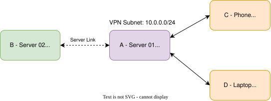

# Wireguard
WireGuard is a fast, simple, and secure VPN protocol. It creates encrypted tunnels between peers (devices) using public and private key pairs. WireGuard operates over UDP only.

Each device has a private key (secret, never shared) and a public key (shared with peers). Only devices with matching keys can communicate. AllowedIPs controls what traffic is routed through the tunnel and which IPs are trusted from each peer. ```/32``` means a single IP, ```/24``` means the whole subnet (10.0.0.0–255). 

I use it to securely connect servers together across locations and to access my home network from anywhere. It allows me to use local services without exposing them to the internet. 

### Setup Diagram

*A is the main hub. (B, C, D) all connect to A as peers. (A, B) connect directly to each other. (C, D) choose between full or split tunnels.*



- A - ```OptiPlex 5080``` located at home
- B - ```PowerEdge T340``` located at work
- C - ```Phone``` located anywhere
- D - ```Laptop``` located anywhere


## Access
- Android: WireGuard app  
- Windows: WireGuard desktop client  

Download: https://www.wireguard.com/install/

## Setup
*COMPLETED 01/01/2026*   
*UPDATED 14/06/2026*

Install Wireguard
```bash
sudo apt update
sudo apt install wireguard
```

Generate new keys
```bash
wg genkey | sudo tee /etc/wireguard/server_private.key | wg pubkey | sudo tee /etc/wireguard/server_public.key
```

```/etc/wireguard/``` is secure by default, so you cannot ```cd``` into it

View generated keys
```bash
sudo cat /etc/wireguard/server_public.key
sudo cat /etc/wireguard/server_private.key
```

Create wireguard config file
```bash
sudo nano /etc/wireguard/wg0.conf
```
```ini
[Interface]
PrivateKey = <Server_Private_Key>
Address = 10.0.0.1/32
ListenPort = 51820

PostUp = iptables -A FORWARD -i %i -j ACCEPT; iptables -t nat -A POSTROUTING -o <Interface> -j MASQUERADE
PostDown = iptables -D FORWARD -i %i -j ACCEPT; iptables -t nat -D POSTROUTING -o <Interface> -j MASQUERADE
```
- Replace ```<Server_Private_Key>``` with the private key generated   
- Replace ```<Interface>``` with your [ethernet interface name](#identify-ethernet-interface-name)

### MAIN SERVER ONLY

Enable IP Forwarding (required for full tunnel)
```bash
# Enable now
sudo sysctl -w net.ipv4.ip_forward=1
# Make it persistent across reboots
echo "net.ipv4.ip_forward=1" | sudo tee -a /etc/sysctl.conf
# Reload settings
sudo sysctl -p
```

### MAIN AND OTHER SERVERS

Allow wireguard on firewall
```bash
sudo ufw allow 51820/udp
sudo ufw reload
sudo ufw status
```
*remember to **[port forward ](#port-forward) 51820/udp***

Enable Wireguard to start on boot
```bash
sudo systemctl enable wg-quick@wg0
```

Check status
```bash
sudo systemctl status wg-quick@wg0
sudo wg show
```

## Adding Peers

For each new peer, generate a new set of keys. Keys can be generated automatically though the Wireguard app, or manually generated though the server. Each peer needs to be added to the server config file before a tunnel connection can be established.

Open server wireguard config
```bash
sudo nano /etc/wireguard/wg0.conf
```

Add new peer to the bottom
```ini
# previous config above ...

[Peer]
PublicKey = <Client_Public_Key>
AllowedIPs = 10.0.0.3/32
```
- Replace ```<Client_Public_Key>``` with the new private key generated   
- Each peer needs a unique AllowedIPs. (For example: ```10.0.0.3/32```, ```10.0.0.4/32```, etc.)

## Connecting to Server
- Android: WireGuard app  
- Windows: WireGuard desktop client  

Download: https://www.wireguard.com/install/

Clients can connect using different types of tunnels.

### Full tunnel
AllowedIPs = 0.0.0.0/0 - all traffic through VPN, A NATs to internet

```ini
[Interface]
PrivateKey = <Client_Private_Key>
Address = 10.0.0.3/32
DNS = 1.1.1.1

[Peer]
PublicKey = <Server_Public_Key>
Endpoint = <Server_Public_IP>:51820
AllowedIPs = 0.0.0.0/0, ::/0
```
- Replace ```<Client_Private_Key>``` to match peer config
- Replace ```10.0.0.3/32``` to match peer config
- Replace ```<Server_Public_IP>``` with your server IP or subdomain
- Update AllowedIPs to match yours

### Split tunnel

AllowedIPs = 10.0.0.0/24 - only VPN subnet routed, internet stays local

```ini
[Interface]
PrivateKey = <Client_Private_Key>
Address = 10.0.0.3/32

[Peer]
PublicKey = <Server_Public_Key>
Endpoint = <Server_Public_IP>:51820
AllowedIPs = 10.0.0.0/24
```
- Replace ```<Client_Private_Key>``` to match peer config
- Replace ```10.0.0.3/32``` to match peer config
- Replace ```<Server_Public_IP>``` with your server IP or subdomain
- Update AllowedIPs to match yours

## Extra Help

### Identify ethernet interface name
```bash
ip link
```
Sample output
```
1: lo: <LOOPBACK>
2: enp3s0: <BROADCAST,MULTICAST,UP,LOWER_UP> # enp3so in this case
```
- ignore ```lo```
- often start with ```enp```, ```eno```, or ```eth```

### Port forward

1. Open browser and visit router page (example [192.168.1.254](http://192.168.1.254/))
2. Log in and find "Port Forwarding" or "NAT" or "Virtual Server"   
3. Add rule:   
    Service name: WireGuard   
    Protocol: UDP   
    Internal host: <Your_Local_Server_IP>     
    External host: *     
    Internal port: 51820    
    External port: 51820     

    Save  
